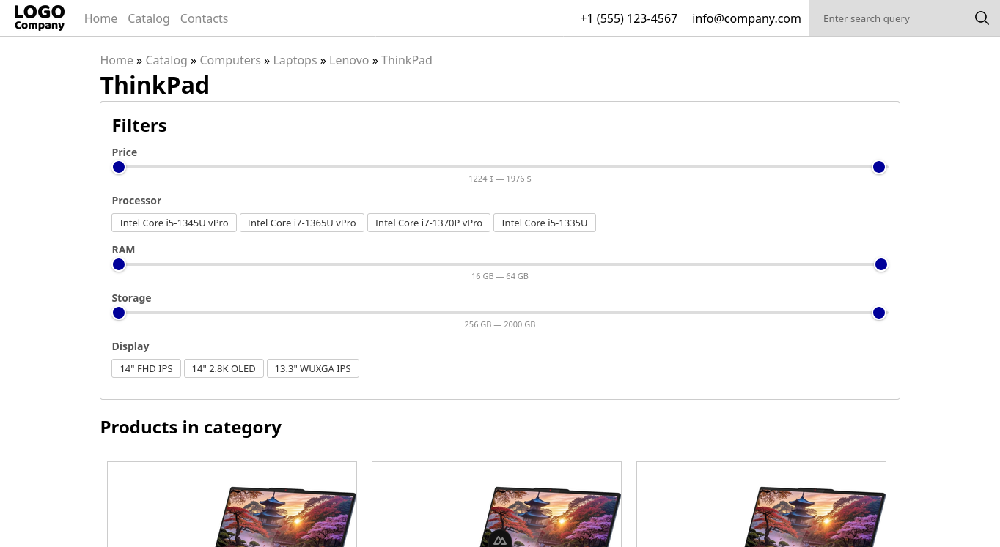

# online-store



A responsive e-commerce frontend built with **Nuxt 4** (SPA mode). Features a catalog with category navigation, product detail pages, client-side search, and dynamic filtering — all powered by mock data.

Live preview: [https://online-store-le95.onrender.com/](https://online-store-le95.onrender.com/).

## Tech Stack

| | |
|---|---|
| **Framework** | [Nuxt 4](https://nuxt.com/) (SPA) |
| **Templating** | Pug |
| **Styling** | SCSS / Sass |
| **Build tool** | Vite |
| **Icons/Fonts** | Quicksand via `@font-face` |

## Features

- **Category catalog** — Multi-level category tree with nested subcategories and breadcrumbs
- **Product listing** — Grid layout with pagination and dynamic filters (text toggles + numeric range sliders)
- **Product detail** — Image gallery, specifications, and description
- **Client-side search** — Real-time search across products and categories by name
- **Responsive design** — Mobile-first layout with adaptive header (hamburger menu, collapsible search)

## Quick Start

```bash
npm install
npm run dev
```

Open [http://localhost:3000](http://localhost:3000).

### Build for production

```bash
npm run generate
npm run preview
```

## Project Structure

```
pages/
  index.vue                  Home page
  catalog/[...slug].vue      Category browser
  product/[pageid].vue       Product detail
  search/[query]/[pageid].vue Search results
  contacts.vue               Contacts page

components/ui/
  header.vue / footer.vue    Layout shell
  page.vue                   Page wrapper
  item.vue                   Product card
  gallery.vue                Image carousel
  breadcrumbs.vue            Auto-generated breadcrumbs
  pagination.vue             Page navigation
  main-page-category.vue     Category card with subcategories
  center.vue                 Centering wrapper

assets/
  css/                       Global styles and fonts
  scss/                      Breakpoints, colors, mixins
  fonts/Quicksand/           Font files
  images/                    Logo and article images

mock.js                      Mock data (categories, products)
lib.js                       Utility functions
```

## Notes

- All data is client-side mock data — no backend required
- Component auto-import is disabled; all components are imported manually
